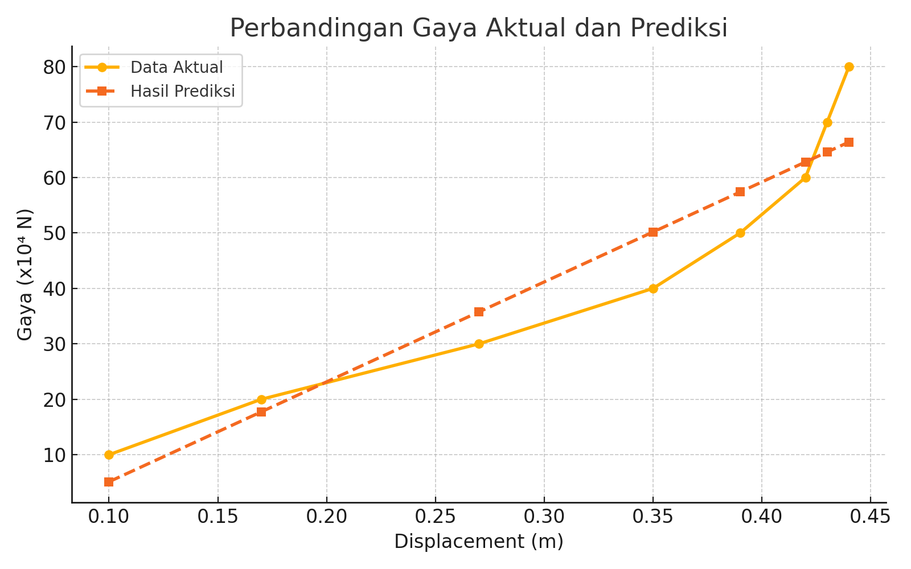

# Regresi Least-Squares pada Sistem Suspensi Mobil

Proyek UAS Metode Numerik  
Nama: Muhammad Hilmi Al Muttaqi  
NPM: 2306267082  
Kelas: Komputasi Numerik 02  
Fakultas Teknik Universitas Indonesia

## Deskripsi Proyek
Sistem suspensi merupakan komponen penting dalam kendaraan yang berfungsi meredam getaran dan menjaga kestabilan selama berkendara. Salah satu aspek krusial dalam mendesain sistem suspensi adalah memahami bagaimana gaya yang diberikan berkorelasi dengan displacement yang terjadi. Proyek ini bertujuan untuk membangun sebuah model matematis berbasis regresi least-squares linear yang merepresentasikan hubungan antara displacement (m) dan gaya (10⁴ N) pada sistem suspensi mobil, menggunakan data eksperimen yang diperoleh dari literatur teknik.

Dengan memanfaatkan metode numerik dan bahasa pemrograman C, model ini dirancang untuk menghitung koefisien regresi optimal dan memprediksi nilai gaya berdasarkan displacement. Model yang dihasilkan:

F(x) = 180.2269x - 12.8979

menunjukkan performa yang cukup baik, dengan nilai Mean Squared Error (MSE) sebesar **55.283630**, membuktikan bahwa model dapat digunakan sebagai pendekatan awal yang andal dalam simulasi atau desain sistem suspensi. Selain menjadi latihan penerapan metode numerik, proyek ini juga bertujuan mendemonstrasikan bagaimana pendekatan ilmiah sederhana dapat memberikan fondasi kuat dalam pengambilan keputusan teknik berbasis data.

## Data
Data diambil dari Tabel P20.49 buku *Applied Numerical Methods with MATLAB* oleh Steven Chapra.

| x (m) | F (10⁴ N) |
|-------|-----------|
| 0.10  | 10        |
| 0.17  | 20        |
| 0.27  | 30        |
| 0.35  | 40        |
| 0.39  | 50        |
| 0.42  | 60        |
| 0.43  | 70        |
| 0.44  | 80        |

## 📊 Visualisasi Hasil Regresi

Berikut adalah grafik perbandingan antara data gaya aktual dengan hasil prediksi dari model regresi linear:

## Struktur File
- `regresi_linear.c` – kode utama untuk menghitung model regresi dan prediksi
- `README.md` – dokumentasi proyek

## Cara Menjalankan
1. Buka terminal/command prompt.
2. Kompilasi program:
   gcc regresi_linear.c -o regresi
3. Jalankan program:
   ./regresi

## Video Demonstrasi
Klik link sebelah ini untuk menonton di YouTube: https://youtu.be/11xuE6K39JQ

📚 Referensi
- S. C. Chapra, Applied Numerical Methods with MATLAB, 4th ed., McGraw-Hill, 2018.
- D. Montgomery and E. A. Peck, Introduction to Linear Regression Analysis, Wiley, 2012.

